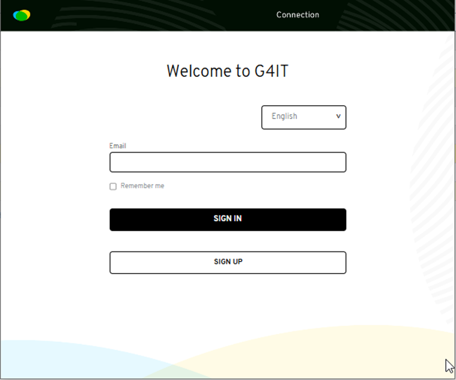
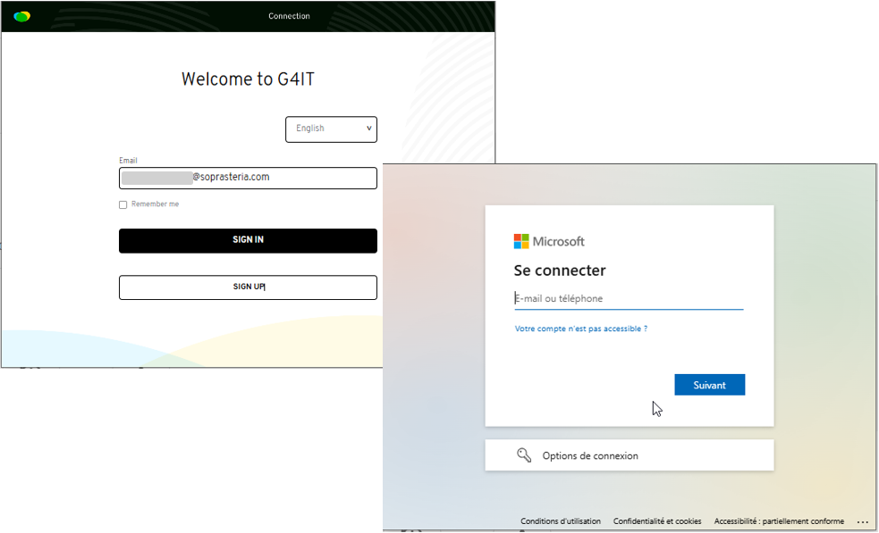
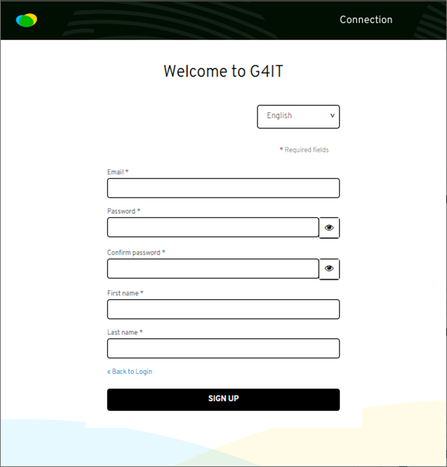
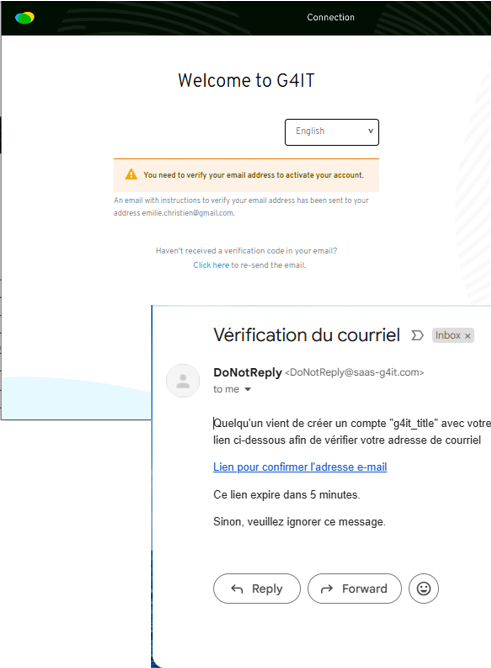
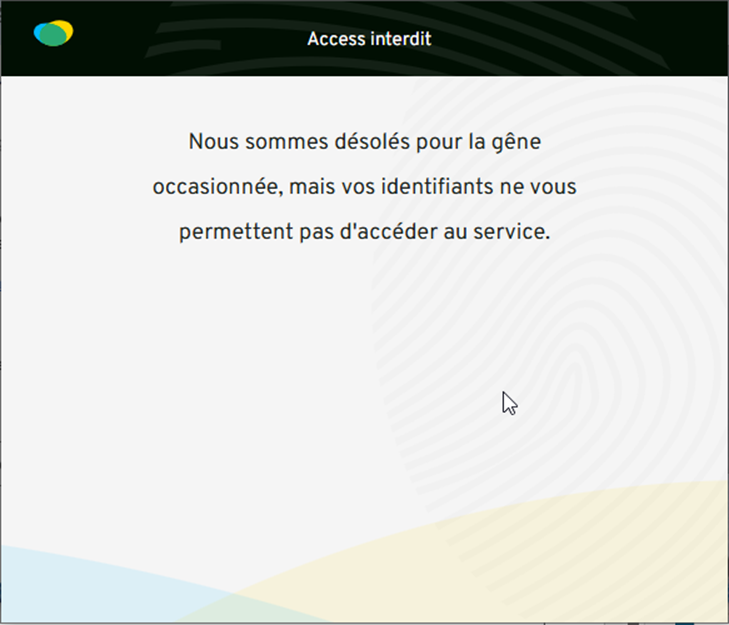

## Objective
Create an account on G4IT and validate your access.

## Step 1 - Access the platform
Go to https://saas-g4it.com/ and click on “Sign Up"

## Step 2 - Connect with your professional email 
Fill in your professional email and click on "Sign In"

If SSO authentication have been put in place for your company, you don't need to create account

## Step 2 - Create an account (no SSO in place)
Fill in the requested information and click on “Sign Up"

## Step 3 - Validate your email address
Open the email you received and click the validation link

## Step 4 - Log back into G4IT
Return to G4IT and log in with your credentials.
⚠ Important: At this point, you will see a message indicating that you do not have access to an organization. This is normal: an administrator still needs to add you.

For a detailed description of the feature, you can refer to the functional documentation [3.1 Manage users](../../../../2-functional-documentation/use_cases/uc_administration/uc_administration_manage_users/_index.md).
