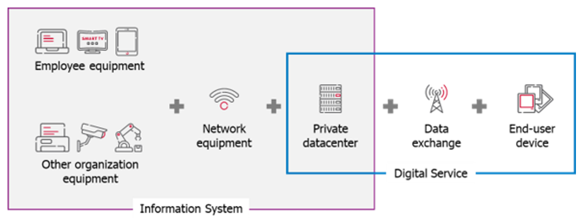

## Overview

A fascinating chapter 💥 to get started with the application.

## Table of contents

<!-- TOC -->
  * [Overview](#overview)
  * [Table of contents](#table-of-contents)
  * [How to use G4IT?](#how-to-use-g4it)
  * [Available modules in G4IT](#available-modules-in-g4it)
<!-- TOC -->

## How to use G4IT?

G4IT supports you all along the measurement processes from inventory data collection to indicators analysis.

* **IMPORT** : Collect data of the items that are part your IS and import them in a centralized view
* **ESTIMATE** : Estimate multi-criteria environmental footprint of your IS and Digital Services
* **VISUALIZE** : Visualize multi-criteria environmental footprint of your IS through preconfigured dashboards
* **EXTRACT** : Extract impact indicators for ad-hoc analysis in your own BI system
* **EVALUATE** : Evaluate environmental footprint of digital services, project teams or technical configuration to
  enlighten a decision-making process

## Available modules in G4IT

There are three available modules:

{}

