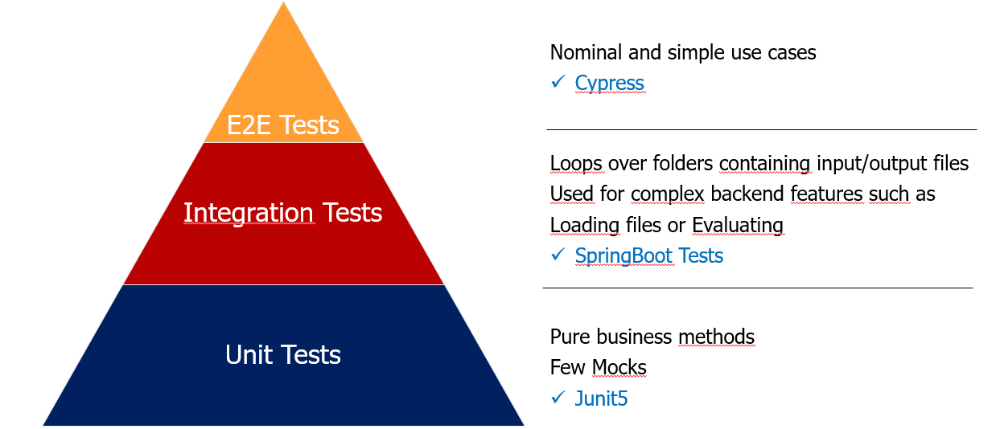

The test strategy has not been well described in the past, consequently, the code base has lot's of useless tests.

The aim of the target test strategy is make meaningful tests on each scope and not overlapping.

__Good tests__ has a higher priority than __test coverage__.

