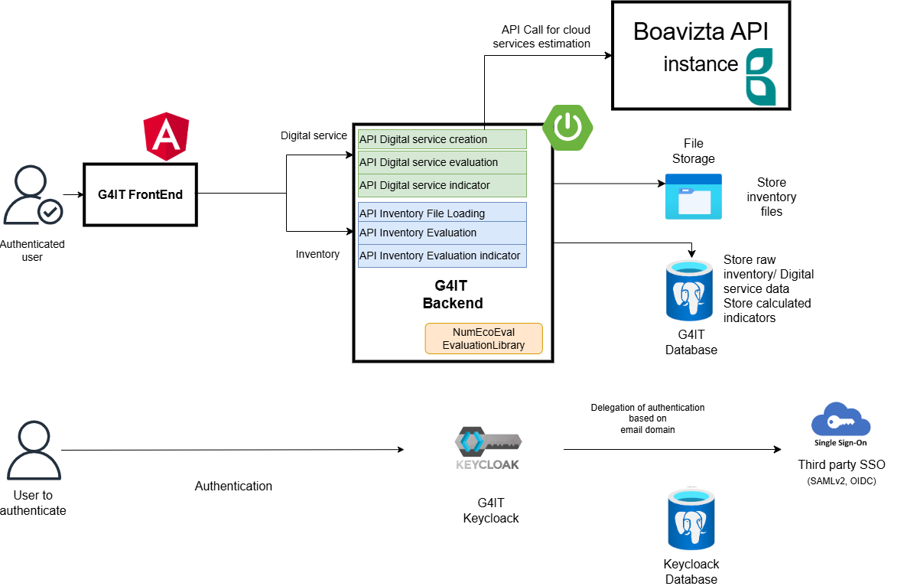

### Overview

Description of the software architecture of the project.

#### Architecture description
As seen in the functional architecture, Green for IT serves two main purposes:
* Evaluation of environmental impact of inventory of Information Systems
* Evaluation of environmental impact of digital services

It offers to the user a web UI to complete and estimate impact of their IT inventory and digital services. The user can also visualize the results of the evaluation. 
This web application is composed of a front-end and a back-end. 

The front-end is a single-page application (SPA) that is built using Angular.

The back-end is composed of RESTful API that are built using Springboot.

Springboot and Angular were choosen as they are widely used and have a large community. They are also easy to use and to maintain.

It stores the data in a PostgreSQL database.
The file storage is intended to store all user inventory files and to generate data exports.
The back-end uses the library numEcoEval to evaluate the environmental impact of the inventory and digital services.
It also calls dedicated G4IT Boavizta APIs to evaluate the environmental impact of cloud services.

In order to use the application, the user must be authenticated. The authentication is done using Keycloak.
Keycloak is an open-source Identity and Access Management solution aimed at modern applications and services.
It makes it easy to secure applications and services with little to no code.
Keycloak delegates the authentication to the user's identity provider as EntraId(Azure AD) or Companies third party identity provider SSO.

#### Backend architecture

The backend is a Restful API built using Springboot 3.
It main purpose is to:
- Load and estimate the user's inventory
- Load and estimate the user's digital services

We don't need to split it to multiple microservices because the application is not that big.

In order to have a deeper understunding of the backend architecture and code base you can refer to the [backend documentation](/3-technical-documentation/4-backend_documentation/).

Concerning framework and library version you can refer to the backend pom.xml file in the [repository](https://github.com/G4ITTeam/g4it/blob/main/services/backend/pom.xml)

The backend must segregate the data by subscriber / organisation. This is done by the caracteristics of the logged user. There is a transversal check of the data access rights done by spring security.
Indeed, each API path contain information about subscriber and organisation. The backend checks that the logged user has the right to access the data using spring security filters.

The github actions are used to build docker image and push it to [the docker registry](https://hub.docker.com/r/g4it/backend/tags)

#### Front end architecture

The front end is a single page application built using Angular 12.

The github actions are used to build docker image and push it to [the docker registry](https://hub.docker.com/r/g4it/frontend/tags)

#### Tools and customizations

In order to secure the application, we use Keycloak as an identity provider.
We customize the Keycloak login page to match the Green for IT design and we add the library keycloak-home-idp-discovery to route the user automatically to his idp.

The produced image of keycloak is pushed to [the docker registry](https://hub.docker.com/r/g4it/keycloak/tags)

#### Global code base

G4IT code is hosted on a mono repository on [github](https://github.com/G4ITTeam/g4it/tree/main)
It builds all the needed docker images and push them to the docker registry using Github actions.
