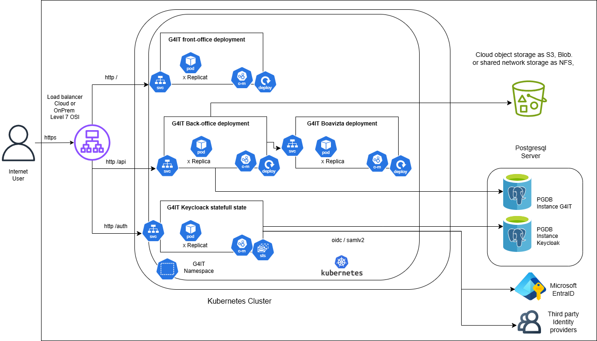

### Overview

G4IT is a cloud-native application that can be deployed on any cloud provider.
As its components are containerized, it can be deployed on any Kubernetes cluster or on any server with Docker installed.

Here is an exemple of docker compose file which can be used as a base to deploy the application on a server with Docker installed [Docker compose](https://github.com/G4ITTeam/g4it/blob/main/workspace/docker/docker-compose-all.yml)

Here you will find an exemple of helm chart to deploy the application on a Kubernetes cluster [Helm chart Repo]()
You will find here all information about how the platform can be deployed depending on the cloud provider.

And finally, you will find here all the information about the technical architecture of the project in any cloud provider or on-premise.

### Data segregation and multi-tenancy
The data must be segregated by subscriber / organisation. Multiple strategies can be used depending on the security requirements of each customer.

#### Software only strategy
Fist data are protected by sotware architecture. An api call of authenticated user can only access data of authorized organization.
Data are stored in a shared PostgreSQL database and shared file storage (S3, Azure Blob, etc).

#### Infrastructure strategy

A subscriber can have its own database and file storage. This strategy is more secure but more expensive as each repository can has its own encrypted at rest database and file storage.
The load balancer can be configured to route the request to the right instance depending on the subscriber.

### Kubernetes deployment

The application is composed of 3 main components each one is containerized as docker image [see docker hub](https://hub.docker.com/u/g4it)

#### Frontend
The frontend is a single page application built using Angular 12. It is served by an Nginx server.
It has its own kubernetes deployment and service.

#### Backend
The backend is a Restful API built using Springboot 3. It is served by an embedded Server.
It has its own kubernetes deployment and service and is connected to a PostgreSQL database and a file storage.
It calls dedicated G4IT Boavizta APIs to evaluate the environmental impact of cloud services.

#### keycloak
Keycloak has its own kubernetes statefullset and service. It is connected to the backend and to the user's identity provider as EntraId(Azure AD) or Companies third party identity provider SSO.
