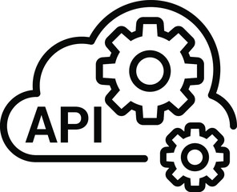

Here we list the most important APIs of the project.
This documentation is intended to describe the main api endpoint and describe how they are architecture.
This is done to help the developers to understand the project and to help them to develop new features. 

For complete API documentation, please refer to the [Open API](https://saas-g4it.com/api/swagger-ui/index.html) documentation.

## Table of contents

{}
