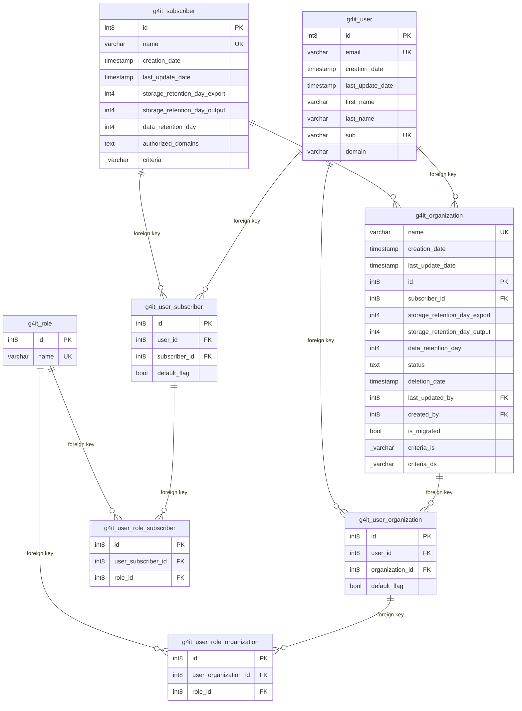

## Entity relationship diagram 

## Tables 

### g4it_role 

{} 

#### Comments 

 - That table defines the possible roles on G4IT and for each module. 

#### Columns 

|Name|Data type|Comments|
|---|---|---|
|**id**|int8||
|name|varchar||

#### Primary Key 

 - id
{}
### g4it_subscriber 

{} 

#### Comments 

 - That table defines the list of the existing subscriber (customer of the platform) and configuration associated. 

#### Columns 

|Name|Data type|Comments|
|---|---|---|
|**id**|int8||
|name|varchar||
|creation_date|timestamp||
|last_update_date|timestamp||
|storage_retention_day_export|int4||
|storage_retention_day_output|int4||
|data_retention_day|int4||
|authorized_domains|text||
|criteria|_varchar||

#### Primary Key 

 - id
{}
### g4it_user 

{} 

#### Comments 

 - That table defines the list of the G4IT users and configuration associated. 

#### Columns 

|Name|Data type|Comments|
|---|---|---|
|**id**|int8||
|email|varchar||
|creation_date|timestamp||
|last_update_date|timestamp||
|first_name|varchar||
|last_name|varchar||
|sub|varchar||
|domain|varchar||

#### Primary Key 

 - id
{}
### g4it_organization 

{} 

#### Comments 

 - That table defines the list of the existing organisations for a subscriber and configuration associated. 

#### Columns 

|Name|Data type|Comments|
|---|---|---|
|name|varchar||
|creation_date|timestamp||
|last_update_date|timestamp||
|**id**|int8||
|*subscriber_id*|int8||
|storage_retention_day_export|int4||
|storage_retention_day_output|int4||
|data_retention_day|int4||
|status|text||
|deletion_date|timestamp||
|*last_updated_by*|int8||
|*created_by*|int8||
|is_migrated|bool||
|criteria_is|_varchar||
|criteria_ds|_varchar||

#### Primary Key 

 - id
#### Foreign keys
|Column name|Referenced table|Referenced primary key|
|---|---|---|
|created_by|g4it_user|id|
|last_updated_by|g4it_user|id|
|subscriber_id|g4it_subscriber|id|

{}
### g4it_user_subscriber 

{} 

#### Comments 

 - That table defines the association between user and subscriber. 

#### Columns 

|Name|Data type|Comments|
|---|---|---|
|**id**|int8||
|*user_id*|int8||
|*subscriber_id*|int8||
|default_flag|bool||

#### Primary Key 

 - id
#### Foreign keys
|Column name|Referenced table|Referenced primary key|
|---|---|---|
|subscriber_id|g4it_subscriber|id|
|user_id|g4it_user|id|

{}
### g4it_user_organization 

{} 

#### Comments 

 - That table defines the association between user and organization. 

#### Columns 

|Name|Data type|Comments|
|---|---|---|
|**id**|int8||
|*user_id*|int8||
|*organization_id*|int8||
|default_flag|bool||

#### Primary Key 

 - id
#### Foreign keys
|Column name|Referenced table|Referenced primary key|
|---|---|---|
|organization_id|g4it_organization|id|
|user_id|g4it_user|id|

{}
### g4it_user_role_subscriber 

{} 

#### Comments 

 - This table defines the correspondence between an equipment type in the inventory and an equipment in the reference inserted in G4IT. 

#### Columns 

|Name|Data type|Comments|
|---|---|---|
|**id**|int8||
|*user_subscriber_id*|int8||
|*role_id*|int8||

#### Primary Key 

 - id
#### Foreign keys
|Column name|Referenced table|Referenced primary key|
|---|---|---|
|role_id|g4it_role|id|
|user_subscriber_id|g4it_user_subscriber|id|

{}
### g4it_user_role_organization 

{} 

#### Comments 

 - That table defines the role of the user for a organization. 

#### Columns 

|Name|Data type|Comments|
|---|---|---|
|**id**|int8||
|*user_organization_id*|int8||
|*role_id*|int8||

#### Primary Key 

 - id
#### Foreign keys
|Column name|Referenced table|Referenced primary key|
|---|---|---|
|role_id|g4it_role|id|
|user_organization_id|g4it_user_organization|id|

{}

