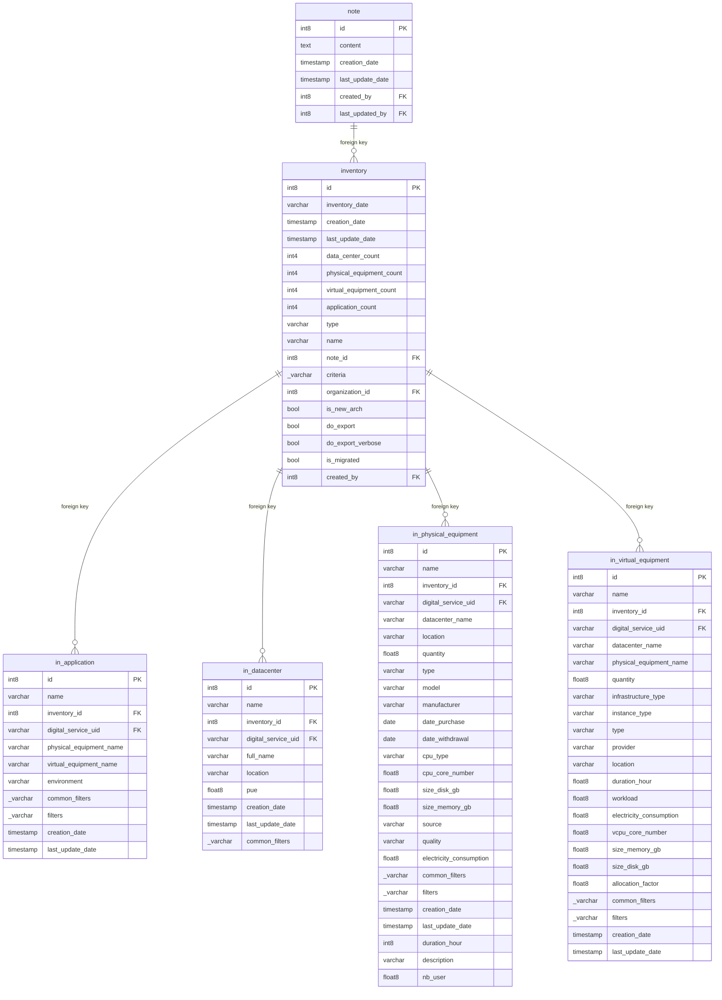

## Entity relationship diagram 

## Tables 

### note 

{} 

#### Comments 

 - That table defines the notes associated with the Information Systems and Digital Services. 

#### Columns 

|Name|Data type|Comments|
|---|---|---|
|**id**|int8||
|content|text||
|creation_date|timestamp||
|last_update_date|timestamp||
|*created_by*|int8||
|*last_updated_by*|int8||

#### Primary Key 

 - id
#### Foreign keys
|Column name|Referenced table|Referenced primary key|
|---|---|---|
|created_by|g4it_user|id|
|last_updated_by|g4it_user|id|

{}
### inventory 

{} 

#### Comments 

 - That table defines the list of information systems and characteristics associated. 

#### Columns 

| Name                     |Data type|Comments|
|--------------------------|---|---|
| **id**                   |int8||
| inventory_date           |varchar||
| creation_date            |timestamp||
| last_update_date         |timestamp||
| data_center_count        |int4||
| physical_equipment_count |int4||
| virtual_equipment_count  |int4||
| application_count        |int4||
| type                     |varchar||
| name                     |varchar||
| *note_id*                |int8||
| criteria                 |_varchar||
| *organization_id*        |int8||
| is_new_arch              |bool||
| do_export                |bool||
| do_export_verbose        |bool||
| is_migrated              |bool||
| *created_by*             |int8||

#### Primary Key 

 - id
#### Foreign keys
|Column name|Referenced table|Referenced primary key|
|---|---|---|
|note_id|note|id|
|organization_id|g4it_organization|id|
|created_by|g4it_user|id|

{}
### in_application 

{} 

#### Comments 

 - That table presents the application data provided by a user for each  Information System or Digital Service in order to evaluate its environmental footprint. 

#### Columns 

|Name|Data type|Comments|
|---|---|---|
|**id**|int8|<ul><li>Auto incremented unique application identifier</li></ul>|
|name|varchar|<ul><li>Name of Application</li></ul>|
|*inventory_id*|int8|<ul><li>Foreign key to the inventory</li></ul>|
|*digital_service_uid*|varchar|<ul><li>Foreign key to the digital service</li></ul>|
|physical_equipment_name|varchar|<ul><li>Name of physical equipment</li></ul>|
|virtual_equipment_name|varchar|<ul><li>Name of Virtual Equipment</li></ul>|
|environment|varchar|<ul><li>Name of Environment</li></ul>|
|common_filters|_varchar|<ul><li>Common Filter of Application</li></ul>|
|filters|_varchar|<ul><li>Domain and Subdomain filters in application view</li></ul>|
|creation_date|timestamp|<ul><li>Creation Date of Application</li></ul>|
|last_update_date|timestamp|<ul><li>Last update date of Application</li></ul>|

#### Primary Key 

 - id
#### Foreign keys
|Column name|Referenced table|Referenced primary key|
|---|---|---|
|digital_service_uid|digital_service|uid|
|inventory_id|inventory|id|

{}
### in_datacenter 

{} 

#### Comments 

 - That table present the datacenter information provided by a user for each  Information System or Digital Service in order to evaluate its environmental footprint. 

#### Columns 

|Name|Data type|Comments|
|---|---|---|
|**id**|int8|<ul><li>Auto incremented unique datacenter identifier</li></ul>|
|name|varchar|<ul><li>Name of Datacenter</li></ul>|
|*inventory_id*|int8|<ul><li>Foreign key to the inventory</li></ul>|
|*digital_service_uid*|varchar|<ul><li>Foreign key to the digital service</li></ul>|
|full_name|varchar|<ul><li>Full Name of Datacenter</li></ul>|
|location|varchar|<ul><li>Location of Datacenter</li></ul>|
|pue|float8|<ul><li>Power Usage Effectiveness of Datacenter</li></ul>|
|creation_date|timestamp|<ul><li>Creation Date of Datacenter</li></ul>|
|last_update_date|timestamp|<ul><li>Last update of Datacenter</li></ul>|
|common_filters|_varchar|<ul><li>Common filters of Datacenter</li></ul>|

#### Primary Key 

 - id
#### Foreign keys
|Column name|Referenced table|Referenced primary key|
|---|---|---|
|digital_service_uid|digital_service|uid|
|inventory_id|inventory|id|

{}
### in_physical_equipment 

{} 

#### Comments 

 - That table present the physical equipment data provided by a user for each  Information System or Digital Service in order to evaluate its environmental footprint. 

#### Columns 

|Name|Data type|Comments|
|---|---|---|
|**id**|int8|<ul><li>Auto incremented unique physical equipment identifier</li></ul>|
|name|varchar|<ul><li>Name of Physical Equipment</li></ul>|
|*inventory_id*|int8|<ul><li>Foreign key to the Inventory</li></ul>|
|*digital_service_uid*|varchar|<ul><li>Foreign key to the Digital Service</li></ul>|
|datacenter_name|varchar|<ul><li>Name of Datacenter</li></ul>|
|location|varchar|<ul><li>Location of physical equipment</li></ul>|
|quantity|float8|<ul><li>Quantity of physical equipment</li></ul>|
|type|varchar|<ul><li>Type of Equipment</li></ul>|
|model|varchar|<ul><li>Physical equipment Model Name</li></ul>|
|manufacturer|varchar|<ul><li>Physical equipment Manufacturer</li></ul>|
|date_purchase|date|<ul><li>Date of purchase of physical equipment</li></ul>|
|date_withdrawal|date|<ul><li>Date withdrawal of physical equipment</li></ul>|
|cpu_type|varchar|<ul><li>CPU type of physical equipment</li></ul>|
|cpu_core_number|float8|<ul><li>CPU core number</li></ul>|
|size_disk_gb|float8|<ul><li>Size disk in gb</li></ul>|
|size_memory_gb|float8|<ul><li>Size disk in gb</li></ul>|
|source|varchar|<ul><li>Source</li></ul>|
|quality|varchar|<ul><li>Quality</li></ul>|
|electricity_consumption|float8|<ul><li>Electricity consumption</li></ul>|
|common_filters|_varchar|<ul><li>Common filters</li></ul>|
|filters|_varchar|<ul><li>Filters</li></ul>|
|creation_date|timestamp|<ul><li>Phyical Equipment Creation Date</li></ul>|
|last_update_date|timestamp|<ul><li>Phyical Equipment Last update date</li></ul>|
|duration_hour|int8|<ul><li>Duration hour</li></ul>|
|description|varchar|<ul><li>Description</li></ul>|
|nb_user|float8|<ul><li>Number of users</li></ul>|

#### Primary Key 

 - id
#### Foreign keys
|Column name|Referenced table|Referenced primary key|
|---|---|---|
|digital_service_uid|digital_service|uid|
|inventory_id|inventory|id|

{}
### in_virtual_equipment 

{} 

#### Comments 

 - That table present the virtual equipment data provided by a user for each  Information System or Digital Service. in order to evaluate its environmental footprint. 

#### Columns 

|Name|Data type|Comments|
|---|---|---|
|**id**|int8|<ul><li>Auto incremented unique virtual equipment identifier</li></ul>|
|name|varchar|<ul><li>Name of Virtual Equipment</li></ul>|
|*inventory_id*|int8|<ul><li>Foreign key to the Inventory</li></ul>|
|*digital_service_uid*|varchar|<ul><li>Foreign key to the Digital service</li></ul>|
|datacenter_name|varchar|<ul><li>Name of Datacenter</li></ul>|
|physical_equipment_name|varchar|<ul><li>Name of physical equipment</li></ul>|
|quantity|float8|<ul><li>Quantity of Virtual Equipment</li></ul>|
|infrastructure_type|varchar|<ul><li>Virtual Equipment Infrastructure type</li></ul>|
|instance_type|varchar|<ul><li>Virtual Equipment Instance type</li></ul>|
|type|varchar|<ul><li>Type of virtual equipment</li></ul>|
|provider|varchar|<ul><li>Virtual Equipment Provider</li></ul>|
|location|varchar|<ul><li>Virtual Equipment Location</li></ul>|
|duration_hour|float8|<ul><li>Duration hour</li></ul>|
|workload|float8|<ul><li>Workload</li></ul>|
|electricity_consumption|float8|<ul><li>Electricity consumption</li></ul>|
|vcpu_core_number|float8|<ul><li>Number of Vcpu core</li></ul>|
|size_memory_gb|float8|<ul><li>Size memory in gb</li></ul>|
|size_disk_gb|float8|<ul><li>Size disk in gb</li></ul>|
|allocation_factor|float8|<ul><li>Allocation factor</li></ul>|
|common_filters|_varchar|<ul><li>Common filters</li></ul>|
|filters|_varchar|<ul><li>Filters</li></ul>|
|creation_date|timestamp|<ul><li>Virtual equipment Creation Date</li></ul>|
|last_update_date|timestamp|<ul><li>Virtual equipment Last update date</li></ul>|

#### Primary Key 

 - id
#### Foreign keys
|Column name|Referenced table|Referenced primary key|
|---|---|---|
|digital_service_uid|digital_service|uid|
|inventory_id|inventory|id|

{}

