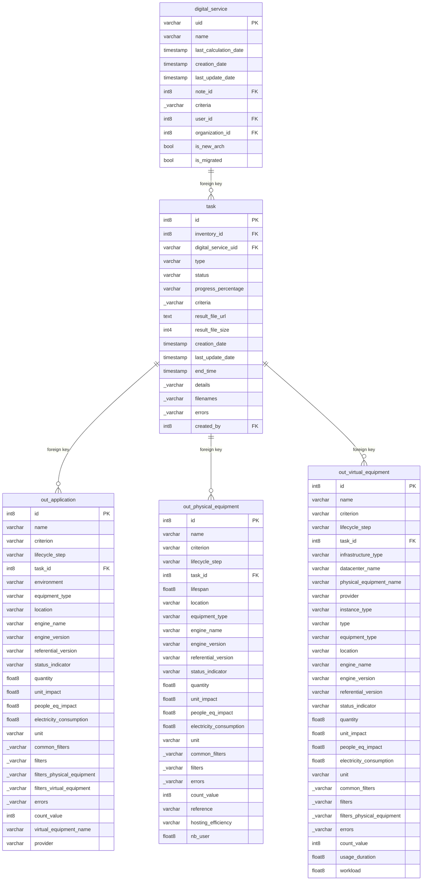

## Entity relationship diagram 

## Tables 

### digital_service 

{} 

#### Comments 

 - That table defines the list of digital services and characteristics associated. 

#### Columns 

|Name|Data type|Comments|
|---|---|---|
|**uid**|varchar||
|name|varchar|<ul><li>Name of Digital Service</li></ul>|
|last_calculation_date|timestamp||
|creation_date|timestamp||
|last_update_date|timestamp||
|*note_id*|int8||
|criteria|_varchar||
|*user_id*|int8||
|*organization_id*|int8||
|is_new_arch|bool||
|is_migrated|bool||

#### Primary Key 

 - uid
#### Foreign keys
|Column name|Referenced table|Referenced primary key|
|---|---|---|
|note_id|note|id|
|organization_id|g4it_organization|id|
|user_id|g4it_user|id|

{}
### task 

{} 

#### Comments 

 - That table follows the treatments done on Information System or Digital Service as integration report data, evaluation report data, export report data. 

#### Columns 

| Name                  |Data type|Comments|
|-----------------------|---|---|
| **id**                |int8||
| *inventory_id*        |int8||
| *digital_service_uid* |varchar||
| type                  |varchar||
| status                |varchar||
| progress_percentage   |varchar||
| criteria              |_varchar||
| result_file_url       |text||
| result_file_size      |int4||
| creation_date         |timestamp||
| last_update_date      |timestamp||
| end_time              |timestamp||
| details               |_varchar||
| filenames             |_varchar||
| errors                |_varchar||
| *created_by*          |int8||

#### Primary Key 

 - id
#### Foreign keys
|Column name|Referenced table|Referenced primary key|
|---|---|---|
|digital_service_uid|digital_service|uid|
|inventory_id|inventory|id|
|created_by|g4it_user|id|

{}
### out_application 

{} 

#### Comments 

 - That table stores the environmental footprint calculated indicators for Digital Service or Information System at application level. 

#### Columns 

|Name|Data type|Comments|
|---|---|---|
|**id**|int8|<ul><li>Auto incremented unique application identifier</li></ul>|
|name|varchar|<ul><li>Name of Application</li></ul>|
|criterion|varchar|<ul><li>Application Criterion</li></ul>|
|lifecycle_step|varchar|<ul><li>Application Lifecycle step</li></ul>|
|*task_id*|int8|<ul><li>Foreign key to the task</li></ul>|
|environment|varchar|<ul><li>Application Environment</li></ul>|
|equipment_type|varchar|<ul><li>Application Equipment type</li></ul>|
|location|varchar|<ul><li>Application Location</li></ul>|
|engine_name|varchar|<ul><li>Application Engine name</li></ul>|
|engine_version|varchar|<ul><li>Application Engine Version</li></ul>|
|referential_version|varchar|<ul><li>Referential version</li></ul>|
|status_indicator|varchar|<ul><li>Status indicator</li></ul>|
|quantity|float8|<ul><li>Quantity</li></ul>|
|unit_impact|float8|<ul><li>Unit impact of Application</li></ul>|
|people_eq_impact|float8|<ul><li>People equivalent impact</li></ul>|
|electricity_consumption|float8|<ul><li>Electricity consumption</li></ul>|
|unit|varchar|<ul><li>Unit of Application</li></ul>|
|common_filters|_varchar|<ul><li>Common filters</li></ul>|
|filters|_varchar|<ul><li>Filters</li></ul>|
|filters_physical_equipment|_varchar|<ul><li>Filters of physical equipment</li></ul>|
|filters_virtual_equipment|_varchar|<ul><li>Filters of virtual equipment</li></ul>|
|errors|_varchar|<ul><li>Errors</li></ul>|
|count_value|int8|<ul><li>Count value</li></ul>|
|virtual_equipment_name|varchar|<ul><li>Name of Virtual Equipment</li></ul>|
|provider|varchar|<ul><li>Provider</li></ul>|

#### Primary Key 

 - id
#### Foreign keys
|Column name|Referenced table|Referenced primary key|
|---|---|---|
|task_id|task|id|

{}
### out_physical_equipment 

{} 

#### Comments 

 - That table stores the environmental footprint calculated indicators for Digital Service or Information System at physical equipment level. 

#### Columns 

|Name|Data type|Comments|
|---|---|---|
|**id**|int8|<ul><li>Auto incremented unique physical equipment identifier</li></ul>|
|name|varchar|<ul><li>Name of Physical Equipment</li></ul>|
|criterion|varchar|<ul><li>Equipment Criterion</li></ul>|
|lifecycle_step|varchar|<ul><li>Equipment Lifecycle Step</li></ul>|
|*task_id*|int8|<ul><li>Foreign key to the inventory</li></ul>|
|lifespan|float8|<ul><li>Lifespan of Equipment</li></ul>|
|location|varchar|<ul><li>Location of Equipment</li></ul>|
|equipment_type|varchar|<ul><li>Equipment type of Equipment</li></ul>|
|engine_name|varchar|<ul><li>Engine name</li></ul>|
|engine_version|varchar|<ul><li>Engine version</li></ul>|
|referential_version|varchar|<ul><li>Referential version</li></ul>|
|status_indicator|varchar|<ul><li>Status indicator</li></ul>|
|quantity|float8|<ul><li>Equipment Quantity</li></ul>|
|unit_impact|float8|<ul><li>Equipment Unit Impact</li></ul>|
|people_eq_impact|float8|<ul><li>People equivalent impact</li></ul>|
|electricity_consumption|float8|<ul><li>Electricity consumption</li></ul>|
|unit|varchar|<ul><li>Equipment Unit</li></ul>|
|common_filters|_varchar|<ul><li>Common filters</li></ul>|
|filters|_varchar|<ul><li>Filters</li></ul>|
|errors|_varchar|<ul><li>Errors</li></ul>|
|count_value|int8|<ul><li>Count value</li></ul>|
|reference|varchar|<ul><li>Referenced physical equipment</li></ul>|
|hosting_efficiency|varchar|<ul><li>Equipment Hosting efficiency</li></ul>|
|nb_user|float8|<ul><li>Number of users</li></ul>|

#### Primary Key 

 - id
#### Foreign keys
|Column name|Referenced table|Referenced primary key|
|---|---|---|
|task_id|task|id|

{}
### out_virtual_equipment 

{} 

#### Comments 

 - That table stores the environmental footprint calculated indicators for Digital Service or Information System at virtual equipment level. 

#### Columns 

|Name|Data type|Comments|
|---|---|---|
|**id**|int8|<ul><li>Auto incremented unique virtual equipment identifier</li></ul>|
|name|varchar|<ul><li>Name of Virtual Equipment</li></ul>|
|criterion|varchar|<ul><li>Equipment Criterion</li></ul>|
|lifecycle_step|varchar|<ul><li>Equipment Lifecycle Step</li></ul>|
|*task_id*|int8|<ul><li>Foreign key to the inventory</li></ul>|
|infrastructure_type|varchar|<ul><li>Equipment Infrastructure type</li></ul>|
|datacenter_name|varchar|<ul><li>Name of Datacenter</li></ul>|
|physical_equipment_name|varchar|<ul><li>Name of physical equipment</li></ul>|
|provider|varchar|<ul><li>Equipment Provider</li></ul>|
|instance_type|varchar|<ul><li>Equipment Instance type</li></ul>|
|type|varchar|<ul><li>Cloud Type</li></ul>|
|equipment_type|varchar|<ul><li>Equipment type</li></ul>|
|location|varchar|<ul><li>Location of virtual equipment</li></ul>|
|engine_name|varchar|<ul><li>Engine Name</li></ul>|
|engine_version|varchar|<ul><li>Engine version</li></ul>|
|referential_version|varchar|<ul><li>Referential version</li></ul>|
|status_indicator|varchar|<ul><li>Status indicator</li></ul>|
|quantity|float8|<ul><li>Quantity of virtual equipment</li></ul>|
|unit_impact|float8|<ul><li>Unit Impact</li></ul>|
|people_eq_impact|float8|<ul><li>People equivalent impact</li></ul>|
|electricity_consumption|float8|<ul><li>Electricity consumption</li></ul>|
|unit|varchar|<ul><li>Unit</li></ul>|
|common_filters|_varchar|<ul><li>Common filters</li></ul>|
|filters|_varchar|<ul><li>Filters</li></ul>|
|filters_physical_equipment|_varchar|<ul><li>Filters physical equipment</li></ul>|
|errors|_varchar|<ul><li>Errors</li></ul>|
|count_value|int8|<ul><li>Count value</li></ul>|
|usage_duration|float8|<ul><li>Usage duration of virtual equipment</li></ul>|
|workload|float8|<ul><li>Average Workload</li></ul>|

#### Primary Key 

 - id
#### Foreign keys
|Column name|Referenced table|Referenced primary key|
|---|---|---|
|task_id|task|id|

{}

