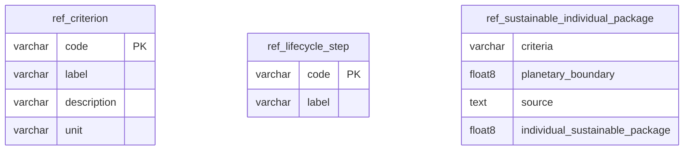

## Entity relationship diagram 

## Tables 

### ref_criterion 

{} 

#### Comments 

 - This table defines the list of possible criteria for environmental impact assessment 

#### Columns 

|Name|Data type|Comments|
|---|---|---|
|**code**|varchar||
|label|varchar||
|description|varchar||
|unit|varchar||

#### Primary Key 

 - code
{}
### ref_lifecycle_step 

{} 

#### Comments 

 - This table lists the stages of the life cycle of an equipment as defined in the life cycle analysis (LCA) methodology. 

#### Columns 

|Name|Data type|Comments|
|---|---|---|
|**code**|varchar||
|label|varchar||

#### Primary Key 

 - code
{}
### ref_sustainable_individual_package 

{} 

#### Comments 

 - This table defines for each criteria the conversion ratio to be taken into account to convert from the criterion unit to the "people equivalent" unit. 

#### Columns 

|Name|Data type|Comments|
|---|---|---|
|criteria|varchar||
|planetary_boundary|float8||
|source|text||
|individual_sustainable_package|float8||

{}

