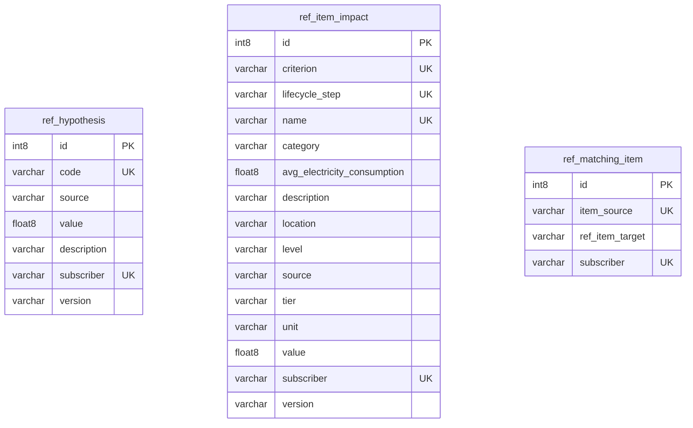

## Entity relationship diagram 

## Tables 

### ref_hypothesis 

{} 

#### Comments 

 - This table defines default values such as PUE, device lifetime, BYOD usage rate (rate of employees using their own work devices to access company resources) and also COPE usage rate (rate of employees using company-provided mobile devices for personal use) 

#### Columns 

|Name|Data type|Comments|
|---|---|---|
|**id**|int8||
|code|varchar||
|source|varchar||
|value|float8||
|description|varchar||
|subscriber|varchar||
|version|varchar||

#### Primary Key 

 - id
{}
### ref_item_impact 

{} 

#### Comments 

 - This table defines the impact factor as well as the average electrical consumption to be taken into account for each piece of equipment depending on the desired criterion and the stage of the life cycle. 

#### Columns 

|Name|Data type|Comments|
|---|---|---|
|**id**|int8||
|criterion|varchar||
|lifecycle_step|varchar||
|name|varchar||
|category|varchar||
|avg_electricity_consumption|float8||
|description|varchar||
|location|varchar||
|level|varchar||
|source|varchar||
|tier|varchar||
|unit|varchar||
|value|float8||
|subscriber|varchar||
|version|varchar||

#### Primary Key 

 - id
{}
### ref_matching_item 

{} 

#### Comments 

 - This table defines the correspondence between an equipment model in the inventory and an equipment in the reference inserted in G4IT. 

#### Columns 

|Name|Data type|Comments|
|---|---|---|
|**id**|int8||
|item_source|varchar||
|ref_item_target|varchar||
|subscriber|varchar||

#### Primary Key 

 - id
{}

