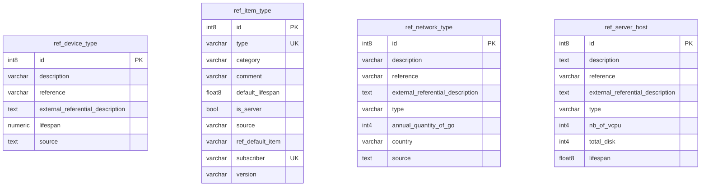

## Entity relationship diagram 

## Tables 

### ref_device_type 

{} 

#### Comments 

 - This table lists the device type which can be selected for the Digital Service definition 

#### Columns 

|Name|Data type|Comments|
|---|---|---|
|**id**|int8||
|description|varchar||
|reference|varchar||
|external_referential_description|text||
|lifespan|numeric||
|source|text||

#### Primary Key 

 - id
{}
### ref_item_type 

{} 

#### Comments 

 - This table defines the correspondence between an equipment type in the inventory and an equipment in the reference inserted in G4IT. 

#### Columns 

|Name|Data type|Comments|
|---|---|---|
|**id**|int8||
|type|varchar||
|category|varchar||
|comment|varchar||
|default_lifespan|float8||
|is_server|bool||
|source|varchar||
|ref_default_item|varchar||
|subscriber|varchar||
|version|varchar||

#### Primary Key 

 - id
{}
### ref_network_type 

{} 

#### Comments 

 - This table lists the network type which can be selected for the Digital Service definition 

#### Columns 

|Name|Data type|Comments|
|---|---|---|
|**id**|int8||
|description|varchar||
|reference|varchar||
|external_referential_description|text||
|type|varchar||
|annual_quantity_of_go|int4||
|country|varchar||
|source|text||

#### Primary Key 

 - id
{}
### ref_server_host 

{} 

#### Comments 

 - This table lists the server type which can be selected for the Digital Service definition 

#### Columns 

|Name|Data type|Comments|
|---|---|---|
|**id**|int8||
|description|text||
|reference|varchar||
|external_referential_description|text||
|type|varchar||
|nb_of_vcpu|int4||
|total_disk|int4||
|lifespan|float8||

#### Primary Key 

 - id
{}

