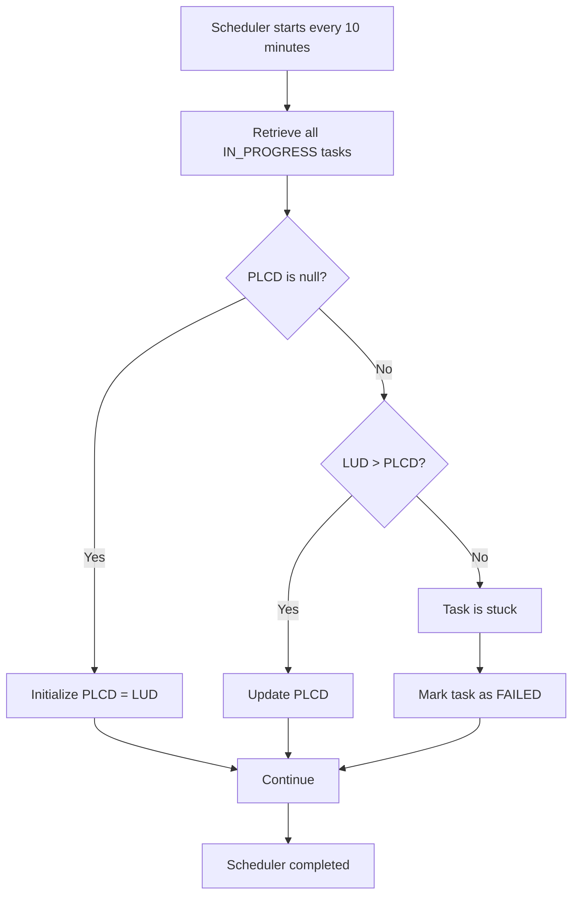

## Overview

The **Stuck Task Scheduler** is responsible for automatically detecting tasks that remain in the **IN_PROGRESS** state without making any progress and marking them as **FAILED**.

Its purpose is to:

- Prevent zombie tasks from remaining indefinitely in the system.
- Free users from manually monitoring stalled executions.
- Provide clear feedback when a task stops progressing unexpectedly.
- Ensure the scheduler continues processing new tasks.

---

# Scheduler Configuration

The scheduler runs periodically using Spring Scheduler and ShedLock.

| Property | Value |
|----------|-------|
| Initial delay | 1 minute |
| Execution interval | Every 10 minutes |
| Lock mechanism | ShedLock |
| Maximum lock duration | 4 minutes |
| Minimum lock duration | 30 seconds |

```java
@Scheduled(fixedDelay = 600000, initialDelay = 60000)
@SchedulerLock(
    name = "failStuckTasks",
    lockAtMostFor = "4m",
    lockAtLeastFor = "30s"
)
```

The scheduler is disabled when the **test** profile is active.

---

# Detection Logic

Only tasks with the status **IN_PROGRESS** are evaluated.

The scheduler compares:

- **LUD** → `lastUpdateDate`
- **PLCD** → `progressLastChangedDate`

These timestamps determine whether a task is still progressing.

## Case 1 – First scheduler execution

If `progressLastChangedDate` is **null**:

- Initialize `progressLastChangedDate = lastUpdateDate`
- Save the task
- Do **not** fail the task

This establishes the baseline for future checks.

---

## Case 2 – Task is progressing

If:

```
lastUpdateDate > progressLastChangedDate
```

then the task has made progress since the previous scheduler execution.

The scheduler:

- Updates `progressLastChangedDate`
- Saves the task
- Leaves the task in **IN_PROGRESS**

---

## Case 3 – Task is stuck

If:

```
lastUpdateDate == progressLastChangedDate
```

or

```
lastUpdateDate < progressLastChangedDate
```

the task has not progressed since the previous scheduler execution.

The scheduler marks the task as **FAILED**.

---

# Failure Actions

When a task is identified as stuck, the scheduler:

- Changes the task status to **FAILED**
- Updates the `lastUpdateDate`
- Preserves the current progress percentage
- Adds an error entry:

```
FAILED BY SCHEDULER
```

- Adds a detail message similar to:

```
Task has been stuck with no updates for X minutes and has been automatically terminated.
```

---

# Workflow



---

# Configuration

The scheduler can be enabled or disabled using the following application property:

```properties
g4it.task.stuck.check.enabled=true
```

When set to:

- `true` → Stuck task detection is active.
- `false` → The scheduler exits immediately without processing tasks.

---

# Benefits

The stuck task scheduler provides several advantages:

- Automatically cleans up stalled tasks.
- Prevents tasks from remaining permanently in the **IN_PROGRESS** state.
- Improves system reliability.
- Provides meaningful feedback to users when long-running processes stop progressing.
- Supports distributed deployments through **ShedLock**, ensuring only one scheduler instance performs the cleanup at a time.
